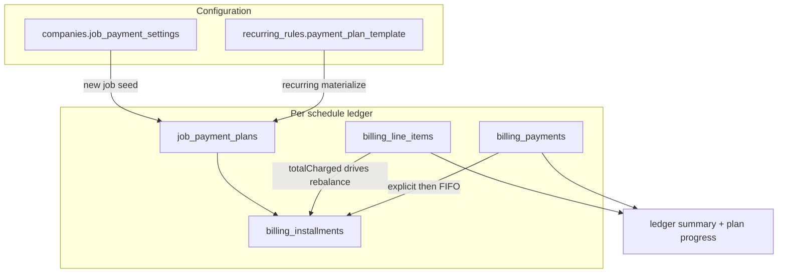
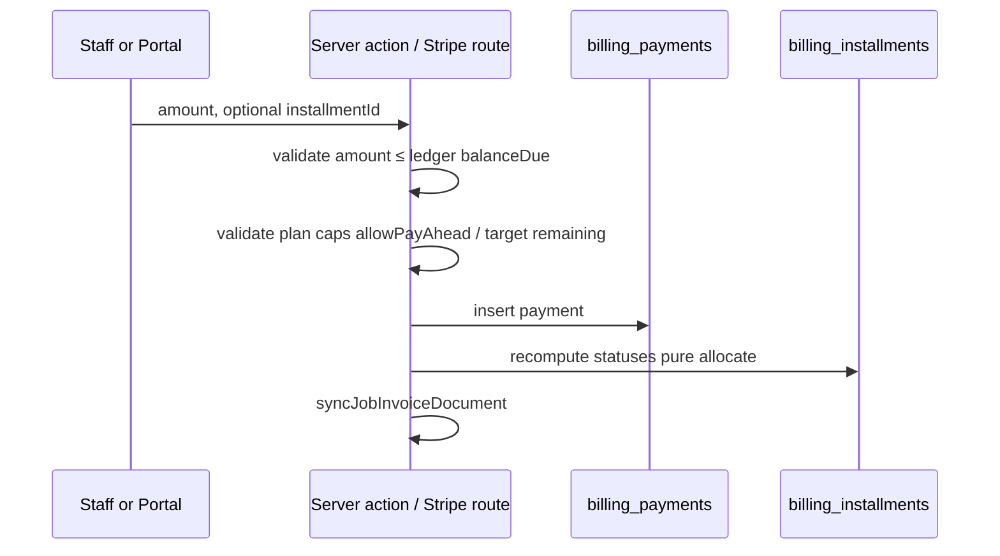
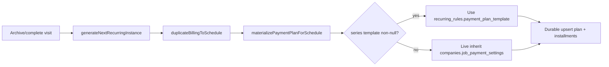
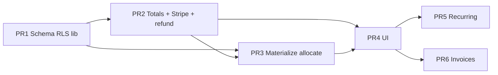

# Flexible Multi-Payment Job Billing

| Field | Value |
| --- | --- |
| **Author** | Engineering (service-portal-v2) |
| **Date** | July 17, 2026 (revised July 23, 2026) |
| **Status** | Approved |
| **Primary codebase** | `C:\Users\ugene\Documents\service-portal-v2` |
| **Related domains** | Job ledger billing, Stripe Connect (client payments), recurring schedules |

---

## Overview

Service businesses frequently collect more than one payment per job: a deposit before work, cash on site, and a card balance after completion. Today the product supports a per-job ledger (`billing_line_items` + `billing_payments`) with partial **manual** payments, but Stripe PaymentIntents always charge the full remaining balance, there is no structured installment/deposit plan, and companies cannot set payment-plan defaults that flow onto jobs and recurring series.

This design **extends** the existing ledger rather than replacing it. A new **payment plan** layer defines *expected* installments (amounts, labels, due timing, collectibility). Actual money still lands in `billing_payments` (cash, check, other, Stripe). Plans can be set company-wide, per job, or on a recurring series with “this visit only” vs “all future visits” semantics. Portal and staff can collect any amount up to the job **ledger** balance (subject to plan flags), optionally targeting a specific installment, while the classic full-balance workflow remains the default for companies that never configure a plan.

**Critical contract:** ledger `balanceDue` is never zeroed for collectibility. Collectibility is expressed only via `amountDueNow` / `maxPayableNow` / flags. See [Billing totals contract](#billing-totals-contract-required).

---

## Background & Motivation

### Current state (verified)

| Area | Behavior | Key files |
| --- | --- | --- |
| Ledger | `billing_line_items` + `billing_payments` per `schedule_id` | `supabase/billing-schema.sql` |
| Summary | `totalCharged - totalPaid = balanceDue` | `lib/billing.ts` → `calcBillingSummary` |
| Manual pay | Partial allowed; amount ≤ balanceDue; methods cash/check/other | `addBillingPaymentAction` in `app/action.ts` (lines ~3254–3268: reject if `roundedAmount > summary.balanceDue + 0.009`) |
| Stripe Connect | PI amount **always** = full remaining balance | `app/api/stripe/create-payment-intent/route.ts` |
| Stripe ledger | `source: 'stripe'`, `method: 'card'`, non-deletable; refunds via webhook | `lib/billing-server.ts` → `recordStripePayment`, `handleStripeRefund` |
| Pre-visit zeroing | `fetchJobBillingTotals` sets `balanceDue: billable ? raw : 0`; portal mappers do the same | `lib/billing-server.ts`, `app/portal/actions.ts`, `lib/staff-activity-server.ts` |
| Company settings | Connect + platform SaaS subscription only; no client payment policy | `supabase/stripe-connect-schema.sql`, `platform-billing-schema.sql` |
| Recurring | `recurring_rules` has frequency only; line items copied, **payments not copied** | `duplicateBillingToSchedule` in `lib/billing-server.ts`; `lib/schedule-status-sync.ts` |
| Portal pay | Pay full balance only; billable only after visit start | `portal-job-pay-panel.tsx`, `isJobBillableForClient` |
| RLS | `billing_line_items` / `billing_payments` staff_all + client_select | `supabase/rls-fix.sql`, `portal-schema.sql` |
| Invoices | PDF in `client_documents`; no installment breakdown | `lib/invoices-server.ts` |

### Pain points

1. **No deposit / installment model** — staff must remember verbal agreements; the system only knows “balance due.”
2. **Stripe is all-or-nothing** — clients cannot pay a deposit online while leaving the rest for later.
3. **No company defaults** — every job starts as “pay full balance whenever,” even when the business always takes 50% up front.
4. **Recurring series ignore payment policy** — only line items are duplicated; there is no series-level plan that materializes onto each visit.
5. **Mixed tender is ad hoc** — cash + Stripe works at the ledger level but is not guided by planned installments.
6. **Display zeroing conflates ledger and collectibility** — pre-visit `balanceDue: 0` blocks deposit PIs and must be split before multi-payment ships.

### Constraint: two billing domains

Do **not** conflate:

- **Platform SaaS billing** — companies pay us (`stripe_platform_*`, `/api/stripe/billing/*`).
- **Client job payments** — clients pay companies via Connect (`billing_payments`, `/api/stripe/create-payment-intent`).

This design only touches **client job payments**.

---

## Goals & Non-Goals

### Goals

1. Structured multi-payment schedules per job: full balance, deposit + remainder, or N custom installments.
2. Company-level default payment plan applied to new jobs; per-job override at any time.
3. Portal + staff can collect **partial** Stripe amounts (not only full remaining balance).
4. Cash / check / other / Stripe may mix freely against the same plan; overpayment blocked at **ledger** `balanceDue` for both manual and Stripe succeed paths.
5. Recurring series: series-level plan defaults materialize onto instances; staff can change **this visit only** or **all future visits** under a single authoritative skip matrix.
6. Backward compatible: jobs with no plan behave as today for full-balance collection after visit start; ledger fields stay truthful.
7. Incremental ship path: value in early PRs without a big-bang rewrite.

### Non-Goals

- Automatic scheduled card charges / saved payment methods / Stripe Subscriptions or Stripe Invoice payment plans for clients.
- Multi-currency or non-USD.
- Splitting a single PaymentIntent across multiple jobs.
- Changing platform SaaS subscription billing.
- Full accounting AR aging product (collections workflows, late fees, finance charges) — installments may carry optional due dates, but dunning is out of scope for v1.
- Replacing invoice PDF generation with a new billing product (only extend content where needed).
- Staff dashboard Stripe card-collect UI in v1 (portal + manual cash/check only for first release; same PI API is ready for later staff UI).
- Multi-job portal cart / one charge across many visits.

---

## Key Decisions

| # | Decision | Rationale |
| --- | --- | --- |
| K1 | **Keep ledger as source of truth; plans are an overlay** | `billing_payments` already powers reports, portal, invoices, refunds. Replacing it would break a large surface. Installments define *expectations*; payments define *reality*. |
| K2 | **Materialize installments as rows per schedule** | Queryable, editable per visit, easy to show in UI and allocate payments. Avoids re-deriving percent plans every read when line items change mid-job. |
| K3 | **Rebalance on line-item change; freeze any installment with `allocatedPaid > 0`** | Job totals change often. Any money already allocated freezes that installment’s floor (`amount_due = max(amount_due, allocatedPaid)` then keep frozen). Pure-zero installments absorb rebalance. |
| K4 | **Payments optionally link to an installment; default allocation is FIFO** | Explicit link for “this cash is the deposit”; FIFO keeps mixed-tender simple when staff do not choose. Single normative algorithm (no “or”). |
| K5 | **Stripe amount is request-driven; cap by ledger + plan flags; re-check at succeed** | Client may request amount; create and succeed both enforce caps. Never trust client. Concurrent PIs allowed; **ledger gate on succeed** is the control. |
| K6 | **Company default stored as JSON template on `companies`** | Matches `booking_settings`, `notification_settings` patterns; no join table required for v1. Structured TypeScript types + Zod validation in app code. |
| K7 | **Series plan stored on `recurring_rules`** | Series is already the shared parent of instances via `schedules.recurring_rule_id`. |
| K8 | **“This visit only” vs “all future” is explicit; all_future uses fixed skip matrix** | No silent mutation. Past/paid/override visits never rewritten unless staff opts into “include customized.” |
| K9 | **Default plan type remains `full_balance`** | Zero config change for existing tenants. |
| K10 | **Separate ledger `balanceDue` from collectible amounts** | Required so pre-visit deposits work. `fetchJobBillingTotals` and portal DTOs must stop zeroing ledger balance for billable gating. |
| K11 | **Null series template = live inherit company default** | Company settings changes apply to future materializations without editing every series. Non-null series template = explicit series override (snapshot). |
| K12 | **Deposit collectibility is per-installment policy** | Default deposit `anytime`; remainder `on_or_after_visit_start`. Not a global company “pre-visit pay” switch. |
| K13 | **Staff Stripe collect UI is out of v1** | Portal partials + staff manual payments ship first. PI API supports staff UI later without schema change. |
| K14 | **No `waived` write path in v1** | Schema may omit `waived` or leave unused. Goodwill = adjust line items / record $0 change via refunds, not waive. |
| K15 | **`allowPayAhead` vs `lockPortalToDueNow` are separate** | `allowPayAhead=false` rejects amount > `amountDueNow` (and targeted over-remaining). `lockPortalToDueNow` only hides free-form amount in portal UI. Both still enforce amount ≤ ledger `balanceDue`. |
| K16 | **Stripe minimum $0.50 USD (no last-pennies exception)** | **v1 rule (normative):** reject create-intent if `amount < 0.50` or `amount > balanceDue`. There is **no** exception when `amount === balanceDue` and residual is under $0.50 — Stripe often rejects sub-$0.50 card charges; residuals under $0.50 are cash/check/other only (`addBillingPaymentAction`). |
| K17 | **Re-materialize upserts by `(schedule_id, key)`; never delete installments with linked payments** | Preserves audit trail and `billing_payments.installment_id`. |
| K18 | **Refund = mutate/delete payment row then pure re-allocate** | No separate refund ledger. Fix cumulative `handleStripeRefund` bug as part of this work. |
| K19 | **First plan attach on jobs with existing payments: create + immediate FIFO allocate + UI note** | Documented product behavior after feature launch. |
| K20 | **Feature flag kills server materialize/rebalance when off** | Not UI-only; prevents wrong allocation logic from running in prod if kill-switched. |
| K21 | **LEDGER_OVERPAYMENT ops: log + alert; manual Stripe refund (v1)** | On succeed-time refuse, log with PI id and alert; staff refund excess in Stripe Dashboard (or support runbook). No auto-refund in v1. |
| K22 | **Staff payment re-link UI ships in v1 (PR4)** | After FIFO attach (or for audit correction), staff can re-assign `billing_payments.installment_id` on the job billing panel. Not deferred to v1.1. |

---

## Proposed Design

### Conceptual model



**Money truth (ledger — always):**

```
totalCharged = Σ line_items.amount
totalPaid    = Σ payments.amount
balanceDue   = totalCharged - totalPaid   // NEVER zeroed for collectibility
```

**Plan layer (new):**

```
Σ installment.amount_due  ≈ totalCharged   (maintained by rebalance rules)
amountDueNow              = remaining on currently collectible open installments
maxPayableNow             = allowPayAhead ? balanceDue : amountDueNow
                            (still ≤ balanceDue always)
```

When no plan exists (implicit `full_balance`):

```
amountDueNow  = billable ? balanceDue : 0
maxPayableNow = amountDueNow   // allowPayAhead N/A without plan rows; same as today after visit start
```

### Billing totals contract (required)

**Breaking change to semantics of returned fields** (callers must be updated in PR2).

`fetchJobBillingTotals` (`lib/billing-server.ts`) and portal DTO builders **must** return:

```ts
type JobBillingTotals = {
  scheduleId: string
  clientId: string
  companyId: string
  jobTitle: string
  lineItemCount: number
  /** Visit-start / status gate (existing isJobBillableForClient) */
  billable: boolean
  summary: {
    totalCharged: number
    totalPaid: number
    /** ALWAYS ledger: totalCharged - totalPaid. Never zeroed for !billable. */
    balanceDue: number
  }
  /** Collectibility-aware; 0 when nothing may be collected right now */
  amountDueNow: number
  /** Max amount allowed for a new payment right now (≤ balanceDue) */
  maxPayableNow: number
  hasCollectibleNow: boolean
  canPay: boolean // amountDueNow > 0 || (allowPayAhead && hasCollectibleNow && balanceDue > 0) — see formula below
  plan: PlanProgressSummary | null
}
```

**Migration from today’s zeroing trick:**

| Today | After |
| --- | --- |
| `balanceDue: billable ? raw : 0` | `summary.balanceDue = raw` always |
| Portal “Pay $0” when not billable | `amountDueNow` / `canPay` drive CTAs |
| PI uses `summary.balanceDue` | PI uses `maxPayableNow` / requested amount capped by ledger `balanceDue` |

**`canPay` formula (normative):**

```
if balanceDue <= 0 → false
if plan is null (implicit full_balance):
  canPay = billable && balanceDue > 0 && lineItemCount > 0
else:
  canPay = lineItemCount > 0 && (
    amountDueNow > 0
    || (allowPayAhead && hasCollectibleNow && balanceDue > 0)
  )
```

With `allowPayAhead=true` and a deposit `anytime`, pre-visit `canPay` is true when deposit remaining > 0 even if `!billable`.

**Required call sites** (all must stop treating zeroed balance as the payable amount):

| Surface | File(s) |
| --- | --- |
| Stripe PI create | `app/api/stripe/create-payment-intent/route.ts` |
| Portal job DTO | `app/portal/actions.ts` → `toPortalJob` |
| Portal home KPIs / payable list | `app/portal/actions.ts`, `lib/portal-jobs.ts` (`getPayableJobs`, `sumBillableBalanceDue`) |
| Portal pay UI | `portal-job-pay-panel.tsx`, `portal-pay-dialog.tsx` |
| Portal lists / hero | `portal-jobs-list`, `portal-schedule-hero`, `portal-activity` (as present) |
| Staff activity feed | `lib/staff-activity-server.ts` |
| Job billing panel | `components/dashboard/job-billing-panel.tsx` via `getJobBillingAction` |

Display labels:

- **Balance remaining** → `summary.balanceDue` (always truthful).
- **Pay now** CTA amount → `amountDueNow` (or user-entered amount ≤ `maxPayableNow`).

### Data model

#### 1. Company default template

```sql
-- supabase/job-payment-plan-schema.sql (new)
alter table public.companies
  add column if not exists job_payment_settings jsonb not null default '{}'::jsonb;

comment on column public.companies.job_payment_settings is
  'Default client job payment plan template. Not platform SaaS billing.';
```

Canonical JSON shape (TypeScript source of truth in `lib/payment-plans.ts`):

```ts
export type JobPaymentPlanType =
  | 'full_balance'      // current behavior
  | 'deposit_remainder' // 1 deposit + 1 remainder
  | 'custom_installments'

export type DepositSpec =
  | { mode: 'percent'; percent: number } // 1–99
  | { mode: 'fixed'; amount: number }

export type InstallmentTemplate = {
  key: string              // stable id within plan, e.g. "deposit", "final"
  label: string            // "Down payment"
  share:
    | { mode: 'percent'; percent: number }
    | { mode: 'fixed'; amount: number }
    | { mode: 'remainder' } // last installment absorbs rounding
  collectible:
    | { when: 'anytime' }
    | { when: 'on_or_after_visit_start' }
    | { when: 'on_or_after_job_complete' }
    | { when: 'relative_days'; daysBeforeStart: number }
  dueOffsetDays?: number | null
}

export type JobPaymentPlanTemplate = {
  version: 1
  type: JobPaymentPlanType
  deposit?: DepositSpec
  installments?: InstallmentTemplate[]
  lockPortalToDueNow?: boolean  // UI only: hide free-form amount in portal
  allowPayAhead?: boolean       // default true: maxPayableNow = balanceDue when any installment collectible
}

export type CompanyJobPaymentSettings = {
  defaultPlan: JobPaymentPlanTemplate
}
```

Default when `{}` or missing:

```ts
{ defaultPlan: { version: 1, type: 'full_balance', allowPayAhead: true } }
```

#### 2. Series-level template

```sql
alter table public.recurring_rules
  add column if not exists payment_plan_template jsonb;

-- null = live inherit companies.job_payment_settings when materializing (K11)
-- non-null = series override snapshot
```

#### 3. Per-job plan + installments

```sql
create table if not exists public.job_payment_plans (
  id uuid primary key default gen_random_uuid(),
  schedule_id uuid not null unique references public.schedules(id) on delete cascade,
  client_id uuid not null references public.clients(id) on delete cascade,
  company_id uuid not null references public.companies(id) on delete cascade,
  plan_type text not null check (plan_type in (
    'full_balance', 'deposit_remainder', 'custom_installments'
  )),
  template jsonb not null default '{}'::jsonb,
  source text not null default 'company_default' check (source in (
    'company_default', 'series_default', 'job_override', 'legacy_none'
  )),
  allow_pay_ahead boolean not null default true,
  lock_portal_to_due_now boolean not null default false,
  /** Set when rebalance detects totalCharged < sum(allocated to installments) or similar */
  needs_attention boolean not null default false,
  needs_attention_reason text,
  created_at timestamptz not null default now(),
  updated_at timestamptz not null default now()
);

create table if not exists public.billing_installments (
  id uuid primary key default gen_random_uuid(),
  schedule_id uuid not null references public.schedules(id) on delete cascade,
  job_payment_plan_id uuid not null references public.job_payment_plans(id) on delete cascade,
  client_id uuid not null references public.clients(id) on delete cascade,
  company_id uuid not null references public.companies(id) on delete cascade,
  sequence int not null check (sequence > 0),
  key text not null,
  label text not null,
  amount_due numeric not null check (amount_due >= 0),
  due_date date,
  collectible_policy jsonb not null default '{"when":"on_or_after_visit_start"}'::jsonb,
  status text not null default 'pending' check (status in (
    'pending', 'partial', 'paid', 'superseded'
  )),
  created_at timestamptz not null default now(),
  updated_at timestamptz not null default now()
  -- NO table-level unique (schedule_id, sequence|key): superseded rows keep
  -- their original key/sequence for audit. Uniqueness is partial (active only).
);

create index if not exists billing_installments_schedule_id_idx
  on public.billing_installments(schedule_id);

-- Partial uniques: only non-superseded rows compete for key/sequence (Issue 18).
-- Allows keeping superseded deposit (key=deposit, sequence=1) while a new plan
-- inserts active sequence 1..n with different or re-used keys.
create unique index if not exists billing_installments_schedule_sequence_active_uidx
  on public.billing_installments (schedule_id, sequence)
  where status <> 'superseded';

create unique index if not exists billing_installments_schedule_key_active_uidx
  on public.billing_installments (schedule_id, key)
  where status <> 'superseded';

alter table public.billing_payments
  add column if not exists installment_id uuid
    references public.billing_installments(id) on delete set null;

create index if not exists billing_payments_installment_id_idx
  on public.billing_payments(installment_id);
```

Notes:

- Status `superseded` is for installments retired on plan-type change that still retain linked payments (see re-materialize). Not a staff “waive” action (K14).
- **Uniqueness:** only active (`status <> 'superseded'`) rows are unique on `(schedule_id, key)` and `(schedule_id, sequence)`. Multiple superseded historical rows may share keys/sequences with each other only if they were never both active at once; in practice each supersede cycle marks the prior active row superseded before inserting/reactivating. Application logic still prefers **un-supersede-by-key** (reuse same row id) over inserting a second row with the same key.
- Prefer **not** using `ON DELETE SET NULL` as the happy path: re-materialize must not delete linked rows. FK `ON DELETE SET NULL` remains a safety net only.

#### 4. RLS (required in PR1)

Mirror `billing_line_items` / `billing_payments` in `supabase/rls-fix.sql` (and portal schema if needed):

```sql
alter table public.job_payment_plans enable row level security;
alter table public.billing_installments enable row level security;

-- Staff: all operations for rows in their company (same helper as billing tables)
-- Client: SELECT only where client_id matches portal-linked client

-- Writes from portal: none. Portal mutations go through server actions / routes
-- using supabaseAdmin (service role), same as today for billing_payments inserts via Stripe.
```

**If** portal loaders continue to use service role exclusively (current pattern for many portal billing reads), client SELECT policies are still required for defense-in-depth and any future direct client queries. Document: **no client INSERT/UPDATE/DELETE policies.**

#### 5. Why not only JSON on `schedules`?

Installments need stable IDs for Stripe metadata and payment allocation, independent status, and durable re-expand by `key`. JSON templates at company/series level are fine; **materialized rows** at job level are required.

### Materialization algorithm

Implemented in `lib/payment-plans.ts` (pure) + `lib/payment-plans-server.ts` (DB).

```ts
function expandTemplate(
  template: JobPaymentPlanTemplate,
  totalCharged: number,
  visitStart: Date
): Array<{ key: string; label: string; sequence: number; amount_due: number; collectible_policy: object; due_date: string | null }>
```

| Plan type | Expansion |
| --- | --- |
| `full_balance` | Single installment: key=`balance`, label=`Balance due`, amount=`totalCharged`, collectible=`on_or_after_visit_start` |
| `deposit_remainder` | keys `deposit` + `remainder`; deposit collectible=`anytime` by default; remainder=`on_or_after_visit_start` |
| `custom_installments` | Apply percent/fixed shares; exactly one `remainder` share last; reject if sum(fixed) > totalCharged on first expand |

Rounding: `Math.round(x * 100) / 100` (same as `calcLineAmount`).

### Durable re-materialize (by key)

**Never** `DELETE FROM billing_installments WHERE schedule_id = ?` then re-insert when payments may exist.

```
function rematerializeInstallments(scheduleId, newTemplate, totalCharged, visitStart):
  desired = expandTemplate(newTemplate, totalCharged, visitStart)  // list by key
  existing = loadInstallments(scheduleId)  // includes superseded
  payments = loadPayments(scheduleId)

  // Prefer active row for a key; else superseded row with that key (newest updated_at).
  function findByKey(key):
    return active row with key
        ?? most-recently-updated superseded row with key
        ?? null

  // 1. Upsert desired keys (un-supersede-by-key when possible)
  for d in desired:
    it = findByKey(d.key)
    if it is not null:
      // REUSE same id forever when key returns (Issue 18)
      // clear superseded → pending/partial after allocate; keep id + payment FKs
      update it:
        status = 'pending'   // allocate will set partial/paid
        key, label, sequence, collectible_policy, due_date from d
        // amount_due handled by rebalance (floor at allocatedPaid)
      // do NOT insert a second row with the same key
    else:
      insert new installment with d (status pending)

  // 2. Keys in existing that are still active but not in desired
  for e in existing where e.status <> 'superseded' and e.key not in desired.keys:
    if e has linked payments OR allocatedPaid > 0:
      mark status = 'superseded'
      // keep row + id forever so FK links remain
      // amount_due stays max(amount_due, allocatedPaid); claims openPool floor (Issue 19)
    else:
      delete e  // safe: no money linked

  // 3. Plan type change with no key overlap (e.g. deposit→custom with different keys)
  //    step 2 supersedes old linked rows; step 1 inserts new keys.
  //    Partial unique indexes allow new sequence 1 while superseded still has sequence 1.

  // 4. Run rebalance + allocatePaymentsToInstallments
  //    openPool subtracts superseded floors so new opens sum to remaining balance
```

**Plan-type change when payments exist:** allowed. Linked installments become `superseded` if keys disappear; remaining ledger balance is covered by new open installments whose amounts sum to `totalCharged − Σ superseded amount_due` (see rebalance). UI confirm: “Existing payments stay linked to prior installment rows for audit.”

**Golden tests (PR1):**

- Payment linked to `deposit` survives label edit and amount rebalance.
- Plan type change deposit→custom does not null `installment_id` on deposit payment.
- Superseded deposit still shows in payment history join.
- Re-introducing key `deposit` after custom plan **reuses** the superseded row id (un-supersede), does not insert a second `deposit` row.
- After supersede + new opens, active unique indexes allow sequences 1..n alongside superseded sequence 1.

### Rebalance when line items change

Triggered from line item add/update/delete (and seed/duplicate billing). **Not** gated on UI feature flag alone — if `ENABLE_JOB_PAYMENT_PLANS` is false, skip rebalance/materialize entirely (K20).

**Freeze rule (normative, K3):**

```
for each installment (including superseded — floors still matter for openPool):
  allocatedPaid = from allocatePaymentsToInstallments(...)
  if status == 'superseded' OR allocatedPaid > 0:
    amount_due = max(amount_due, allocatedPaid)  // floor
    frozen = true
  else:
    frozen = false
// superseded: never redistribute into them; always count amount_due in claimed (Issue 19)
```

**Redistribute (Issue 19 — openPool must claim superseded floors):**

```
claimed = Σ amount_due of frozen non-superseded installments
        + Σ amount_due of superseded installments
          // floors already max(amount_due, allocatedPaid); money already recognized on plan layer

openPool = totalCharged - claimed
if openPool < -0.009:
  needs_attention = true
  set all non-frozen non-superseded amount_due = 0
else:
  distribute openPool across non-frozen non-superseded installments using template shares
```

1. Compute `claimed` / `openPool` as above (if negative → `needs_attention`, zero non-frozen opens).
2. Among non-frozen, non-superseded installments, apply template shares to `openPool`:
   - **Percent shares:** scale to openPool; last remainder key absorbs cents.
   - **Fixed shares:** assign `min(fixed, remainingPool)` in sequence order; remainder key gets the rest; if pool exhausted before later fixed keys, those get `0`.
3. Superseded installments: never receive new target amounts; keep floor; **always included in `claimed`**.
4. If `totalCharged == 0` (all lines deleted): freeze floors still apply; non-frozen → 0; `needs_attention` if any `allocatedPaid > 0`.
5. **Invariant (successful rebalance, not needs_attention):**  
   `Σ amount_due` over **all** non-deleted rows (active + superseded) = `totalCharged` (±0.01).  
   Equivalently: `Σ amount_due of open (non-superseded) ≈ totalCharged − Σ amount_due of superseded`.
6. Clear `needs_attention` when `totalCharged >= Σ allocatedPaid` and the sum invariant holds.
7. Line-item mutation **always commits**; rebalance sets `needs_attention` rather than failing the line-item write.

**Worked examples (required unit tests in PR1):**

| Case | Result |
| --- | --- |
| Deposit $300 paid, job $1000→$800 | Deposit stays $300; remainder becomes $500 |
| Deposit $300 paid, job $1000→$250 | Deposit stays $300; remainder $0; `needs_attention=true` (“Payments exceed revised job total”) |
| Half-paid deposit $150 of $300, job shrinks | Deposit `amount_due = max(recomputed, 150)` frozen; never below $150 |
| Fixed $400 + $400 + remainder on $1000 → total $500 | First fixed min(400,500)=400; second min(400,100)=100; remainder 0 if no room |
| Deposit $300 paid then plan-type change supersedes deposit; job still $1000 | Superseded deposit stays $300; **new open installments sum to $700**, not $1000; `Σ all amount_due = 1000` |

**FIFO sort for allocation (ascending, not display order):**

```
order by payment_date ASC, created_at ASC, id ASC
```

Note: `getJobBillingAction` may still return payments `payment_date DESC` for display; allocation **must not** reuse display order.

### Payment application



#### Normative allocation algorithm

No optional branches for implementers. Flags only change **whether the payment is accepted**, not how status is painted after accept.

```
function sortPayments(payments):
  return payments sorted by (payment_date ASC, created_at ASC, id ASC)

function allocatePaymentsToInstallments(installments, payments):
  // installments: active + superseded (superseded still accept their linked payments only)
  open = installments where status != 'superseded' sorted by sequence ASC
  remaining = map installment.id -> amount_due  // working remaining capacity for status

  allocated = map id -> 0

  // Pass 1: explicit links
  for p in sortPayments(payments) where p.installment_id is not null:
    target = installment by p.installment_id
    if target is null: treat p as unlinked (pass 2)
    else:
      take = min(p.amount, remaining[target] or 0)  // remaining may be 0 if over-target
      // Always credit full p.amount toward job totalPaid (caller already inserted)
      // For installment status only:
      if take > 0:
        allocated[target] += take
        remaining[target] -= take
      spill = p.amount - take
      if spill > 0:
        // FIFO spill across open installments by sequence (including other keys)
        for inst in open:
          if spill <= 0: break
          t = min(spill, remaining[inst])
          allocated[inst] += t
          remaining[inst] -= t
          spill -= t
        // any leftover spill after all open filled: ignored for installment status
        // (job is over-allocated → needs_attention if totalPaid > totalCharged)

  // Pass 2: unlinked payments FIFO
  for p in sortPayments(payments) where p.installment_id is null:
    left = p.amount
    for inst in open:
      if left <= 0: break
      t = min(left, remaining[inst])
      allocated[inst] += t
      remaining[inst] -= t
      left -= t

  // Status
  for inst in installments:
    paid = allocated[inst] or 0
    if inst.status == 'superseded': keep superseded (paid still shown)
    else if paid >= inst.amount_due - 0.009: status = paid
    else if paid > 0: status = partial
    else: status = pending

  return allocated
```

#### Payment acceptance rules (before insert)

```
ledgerBalanceDue = totalCharged - totalPaid
if amount <= 0: reject
if amount > ledgerBalanceDue + 0.009: reject   // same epsilon as addBillingPaymentAction

if plan is null:
  // implicit full_balance
  if !billable: reject for portal; staff manual may still record (existing staff behavior)
  accept

// plan present
amountDueNow = sum remaining on installments where collectibleNow && status not in (paid, superseded)
maxPayableNow = allowPayAhead ? ledgerBalanceDue : amountDueNow

if amount > maxPayableNow + 0.009: reject

if installmentId provided:
  inst = load; must belong to schedule
  if !allowPayAhead && amount > remaining(inst) + 0.009: reject
  if allowPayAhead && amount > remaining(inst): accept; spill handled in allocate
  // targeting a fully paid installment with allowPayAhead=false: reject
  // targeting superseded: reject
```

**Flags:**

| Flag | Effect |
| --- | --- |
| `allowPayAhead` | `false` → `maxPayableNow = amountDueNow`; targeted pay cannot exceed installment remaining |
| `lockPortalToDueNow` | Portal UI only: hide “Pay other amount”; server still enforces `allowPayAhead` |

### Applying a plan to jobs with existing payments

When staff first attaches a non-default plan (or resets) on a job that already has `billing_payments`:

1. Create/upsert `job_payment_plans` + installments via durable re-materialize.
2. Immediately run `allocatePaymentsToInstallments` (all existing payments start unlinked unless already linked).
3. FIFO will mark early installments paid in payment order — **product-accepted**.
4. UI banner (required): **“Existing payments were allocated in payment order (oldest first). Re-link individual payments if needed.”** Staff re-link control ships in v1 (PR4, K22).
5. Enabling `lockPortalToDueNow` on a job with unconfirmed allocation: allow, but show same banner (no hard block).
6. **`resetJobPaymentPlanAction`:**
   - If resulting effective type is implicit `full_balance` (company default full): delete only installments with zero allocatedPaid and no links; supersede the rest; or drop plan row when no payments — preferred: set plan null when full_balance and no need for rows.
   - If payments exist and reset would change structure: require confirm flag `confirmReallocate: true`.

### Stripe partial amounts

#### Create PaymentIntent

**Request:**

```ts
{
  scheduleId: string
  clientId: string
  amount?: number           // dollars; omit = amountDueNow (if > 0) else maxPayableNow
  installmentId?: string    // optional; PR1+ only; stored in PI metadata
}
```

**Server validation (create):**

```ts
const billing = await fetchJobBillingTotals(...) // new contract
const ledgerDue = billing.summary.balanceDue
const dueNow = billing.amountDueNow
const maxPay = billing.maxPayableNow
const requested = body.amount ?? (dueNow > 0 ? dueNow : maxPay)

if (billing.lineItemCount === 0) reject
if (ledgerDue <= 0) reject
if (!billing.canPay && !staffOverride) reject  // portal uses canPay
// K16: no last-pennies exception — always enforce Stripe card minimum
if (requested < 0.50) {
  reject 'Minimum card payment is $0.50. Pay remaining balance under $0.50 with cash or check.'
}
if (requested > ledgerDue + 0.009) reject
if (requested > maxPay + 0.009) reject
// installmentId: validate ownership if present
```

Optional create-time idempotency (not a full concurrency fix):

```
idempotencyKey = `pi_${scheduleId}_${amountCents}_${installmentId ?? 'none'}_${floor(unix/30)}`
```

Reduces double-clicks; **does not** replace succeed-time ledger gate.

#### Succeed-time balance recheck (required)

In `recordStripePayment` (both confirm-payment route and webhook):

```ts
// After PI succeeded and before insert:
const live = await loadLedger(scheduleId)
const amount = paymentIntent.amount_received / 100

if (existing row for paymentIntentId) return duplicate success

if (amount > live.balanceDue + 0.009) {
  // REFUSE to record — do not silently truncate
  log error with scheduleId, paymentIntentId, amount, balanceDue
  // Alert / needs ops: money captured on Stripe but not in ledger
  // Document: support refunds excess via Stripe dashboard or scripted refund
  throw / return { success: false, error: 'overpayment', code: 'LEDGER_OVERPAYMENT' }
}

// then insert; then allocate; then revalidate
```

**Concurrency policy:**

1. Multiple open PIs for the same job are **allowed** (tabs, staff+client).
2. First succeed that fits balance records; later succeeds that would exceed balance **refuse ledger insert**.
3. Abandoned/orphan PIs (user changed amount and recreated session) are OK; unused PIs expire/cancel in Stripe naturally.
4. On portal “Pay other amount” or amount change: **discard** previous `clientSecret` / `paymentSession` and create a new PI (never reuse old secret for a different amount).
5. Confirm path should re-read PI amount and re-validate against live balance (not trust client session amount alone).
6. **Tests:** double succeed with two PIs each for $400 on $500 balance → one recorded, one `LEDGER_OVERPAYMENT`.

#### Portal UI (PR4; PR2 minimal)

**PR2 minimal:** server accepts optional `amount`; portal CTA can remain “Pay full ledger balance when billable” using new fields (`maxPayableNow` when billable). **No** free-form amount picker required in PR2.

**PR4 full:**

- Default CTA: `Pay {formatCurrency(amountDueNow)}`.
- Secondary: “Pay other amount” → input capped at `maxPayableNow` (hidden if `lockPortalToDueNow`).
- Chips for open collectible installments.
- Re-entry discards prior session (Issue 13).

**Staff Stripe collect UI:** out of v1 (K13). Staff use manual payment form.

### Collectibility helpers

```ts
function isInstallmentCollectible(inst, schedule, now): boolean
function getAmountDueNow(...): number
function getMaxPayableNow(...): number
```

Existing `isJobBillableForClient` remains for implicit full_balance and for remainder-style policies.

### Company settings UI

Location: Dashboard Settings (near Stripe Connect — client payments section, **not** platform subscription).

- Plan type radio: Full balance | Deposit + remainder | Custom installments
- Deposit % or $
- Installment editor (label, share, collectibility)
- Toggles: allow pay ahead, lock portal to due now
- Preview: “On a $1,000 job → Deposit $300, Final $700”
- Copy: “Applies to new jobs. Existing jobs keep their current plan unless updated.”

Server actions: `getCompanyJobPaymentSettingsAction`, `updateCompanyJobPaymentSettingsAction`.

### Per-job UI (`JobBillingPanel`)

- Installments table: label, due, amount, paid, status, collectible
- Banner when `needs_attention`
- Banner when existing payments FIFO-allocated after first plan attach
- Edit plan…, Reset to company/series default
- Record payment: amount + method + optional installment (manual only in v1)
- Recurring save dialog:

```
Apply payment plan changes to:
( ) This visit only
( ) This and all future visits
[ ] Include visits with customized plans (job_override)
```

### Recurring semantics



#### Authoritative `all_future` matrix (K8)

When staff saves plan with `applyMode: 'all_future'`:

1. Write `recurring_rules.payment_plan_template` (snapshot of new template).
2. Select candidate instances: same `recurring_rule_id`, `status in ('scheduled','in_progress')`.
3. For each instance, apply:

| Instance state | all_future behavior |
| --- | --- |
| `start_time <= now` OR status `archived` / `cancelled` | **never touch** → `skippedPast` |
| has any row in `billing_payments` | **skip** → `skippedPaid` |
| `job_payment_plans.source = 'job_override'` AND not `includeCustomized` | **skip** → `skippedOverride` |
| else (including installments present with $0 paid, source company/series) | **re-expand** from new series template via durable re-materialize → `updated` |

4. Return structured counts:

```ts
{ updated: number; skippedPast: number; skippedPaid: number; skippedOverride: number }
```

Toast example: “Updated 12 future visits; skipped 2 with payments, 1 customized.”

| Action | Behavior |
| --- | --- |
| New recurring series | Leave `payment_plan_template` **null** (live inherit, K11) unless staff sets series override |
| Next instance generated | `duplicateBillingToSchedule` then materialize from series template ?? company default. **Never copy payments or installment statuses.** |
| Edit — this visit only | Durable re-materialize that schedule; `source=job_override`; do not touch `recurring_rules` |
| Edit — all future | Matrix above |
| Past visits with payments | Untouched by all_future; line-item rebalance still applies if prices change |

Call sites for materialize on create:

- `lib/schedule-status-sync.ts` → `generateNextRecurringInstance`
- `app/action.ts` (~6361 and any other recurring create paths)
- `app/booking-actions.ts` when booking creates a job

### Refunds vs installments

**Model:** Refund is not a separate ledger entity. Stripe webhook → `handleStripeRefund` mutates or deletes the `billing_payments` row → pure `allocatePaymentsToInstallments` recomputes installment status.

| Event | Behavior |
| --- | --- |
| Partial refund | Reduce payment.amount; re-allocate; installment may return to `partial`/`pending` |
| Full refund | Delete payment row; re-allocate; linked installment loses that allocation |
| Deposit refunded | Deposit installment returns to pending/partial; product language: “deposit unpaid” again |

**No manual re-link required** after refund if pure recompute is used.

#### Known bug: `handleStripeRefund` cumulative math (must fix)

Current code compares **cumulative** `charge.amount_refunded` (or passed `refundedAmount`) against **current** `payment.amount` after prior partials already reduced the row. Successive partial refunds can under-state remaining payment.

**Required fix (PR2 or PR3 — blocking for plan status correctness):**

Preferred approach:

```ts
// Store original amount once, or compute from Stripe charge
// Option A: add billing_payments.original_amount (nullable; backfill = amount for old rows)
// Option B: on each refund event, use refund.amount (delta) from Stripe event, not cumulative
```

**v1 choice: Option B** — webhook handler uses the **refund delta** from the Stripe event (`charge.refunded` / `refund.updated` payload amount for this refund), subtract delta from current payment.amount, delete if ≤ epsilon. Do not pass cumulative `amount_refunded` as if it were a single delta.

**Test:** deposit PI $300 → partial refund $100 → payment $200, deposit partial → full refund remainder → payment gone, deposit pending.

### New / extended pure helpers

```ts
export type PlanProgressSummary = {
  amountDueNow: number
  maxPayableNow: number
  amountPaidOnPlan: number
  nextInstallment: { id: string; label: string; remaining: number } | null
  installments: Array<{
    id: string
    sequence: number
    key: string
    label: string
    amountDue: number
    amountPaid: number
    remaining: number
    status: 'pending' | 'partial' | 'paid' | 'superseded'
    collectibleNow: boolean
    dueDate: string | null
  }>
  hasCollectibleNow: boolean
  allowPayAhead: boolean
  lockPortalToDueNow: boolean
  needsAttention: boolean
  needsAttentionReason: string | null
}
```

Extend `JobBillingData` with `paymentPlan` + always-raw `summary.balanceDue` + `amountDueNow` / `maxPayableNow` / `canPay`.

### Seed path for new jobs

1. Resolve template: series non-null template ?? company default.
2. If effective type is `full_balance` and no override needed → **no plan rows** (null ≡ full_balance).
3. Else durable materialize installments from `totalCharged`.
4. If payments already exist (rare on create): immediate allocate + note.

Pre-feature jobs: leave null plan until staff attaches one or company default is non-full and job is newly created.

### Invoice PDF

v1 (PR6): **Payment schedule** section on invoice PDFs when the job has a non-default plan (`deposit_remainder` / `custom_installments`) with active installments. Rows show label, optional due date, status, and amount (remaining when partially paid). Ledger **Balance due** line is unchanged and still equals totalCharged − totalPaid.

### Reports

No schema change for cash collected. Optional later: deposits outstanding. Out of scope for initial PRs beyond job panel status.

---

## API / Interface Changes

### Server actions

| Action | Purpose |
| --- | --- |
| `getCompanyJobPaymentSettingsAction` | Load settings |
| `updateCompanyJobPaymentSettingsAction` | Save validated template |
| `getJobBillingAction` | **Extended** with plan progress + raw balanceDue + amountDueNow |
| `setJobPaymentPlanAction` | Set plan; `applyMode: 'this_visit' \| 'all_future'`; `includeCustomized?: boolean` |
| `resetJobPaymentPlanAction` | Re-inherit; `confirmReallocate?: boolean` when payments exist |
| `addBillingPaymentAction` | **Extend** with optional `installmentId`; keep existing balanceDue clamp as precedent |

### Stripe routes

| Route | Change |
| --- | --- |
| `create-payment-intent` | Optional `amount` / `installmentId`; validate ledger + maxPayableNow + Stripe min; optional idempotency key |
| `confirm-payment` | Pass metadata; **succeed-time balance recheck** via `recordStripePayment` |
| webhook | Same `recordStripePayment` gate; refund delta fix + re-allocate |

### Types

```ts
// addBillingPaymentAction
{ /* existing */ installmentId?: string }

// create-payment-intent
{ scheduleId: string; clientId: string; amount?: number; installmentId?: string }

// recordStripePayment result
{ success: true; duplicate?: boolean } | { success: false; code: 'LEDGER_OVERPAYMENT'; ... }
```

---

## Data Model Changes

### Migration strategy

1. Additive SQL (`job-payment-plan-schema.sql`) including **RLS policies**.
2. No backfill required (null plan = today for full_balance after visit start).
3. `billing_payments.installment_id` nullable; historical unlinked; FIFO on first plan attach.
4. Optional later: offline materialize open jobs — not v1.

### Storage estimates

- ~1 plan row + 2–5 installment rows per planned job; superseded rows rare.
- 100k jobs/year with plans: well within Postgres comfort.

---

## Alternatives Considered

### A1. Soft notes only

Rejected — no portal deposits, no series defaults.

### A2. Full AR invoice domain rewrite

Rejected — too large; constraint is extend ledger.

### A3. Partial PI only, no installment tables

Rejected as complete solution; partial amounts still ship early (PR2) as a slice.

### A4. Normalized shared `payment_plan_templates` table

Deferred — JSON defaults match existing company settings patterns.

### A5. Always create installment rows for full_balance

Rejected hybrid — implicit full_balance without rows unless customized.

### A6. Stripe-native Invoices / Subscriptions / payment plans on Connect

- **Pros:** Stripe-hosted installments, dunning, customer portal.
- **Cons:** Duplicates or replaces local ledger that already drives reports, invoices PDFs, cash/check, portal ACL, and recurring job materialization; Connect invoice product does not model mixed cash+card against a job schedule; SaaS confusion risk with platform Billing API; multi-payment for field-service jobs is often deposit+remainder, not a Stripe Subscription.
- **Rejected for v1:** Keep PaymentIntents for card capture only; plan state lives in our DB next to `schedules`. Aligns with Non-Goals (no Stripe Subscriptions/Invoices for client job plans).

---

## Security & Privacy Considerations

| Threat | Severity | Mitigation |
| --- | --- | --- |
| Client underpays then marks job paid | Medium | Paid-in-full only when ledger `balanceDue <= 0` |
| Concurrent PIs over-collect | High | Succeed-time refuse if amount > live balanceDue; alert |
| Client requests PI > balanceDue | High | Create + succeed reject |
| Client requests PI &lt; $0.50 (incl. last pennies) | Low | Server rejects all card amounts &lt; $0.50; residual via cash/check (K16) |
| Client pays another client’s job | High | `assertJobAccess` / `verifyScheduleCompanyAccess` |
| installment_id spoof | High | Validate installment.schedule_id |
| Series all_future rewrites paid visits | Medium | Skip matrix |
| Platform billing confusion | Medium | Separate settings; never touch `stripe_platform_*` |
| Orphan PI after amount change | Low | Discard session; succeed gate |

Refunds: webhook → payment mutate/delete → re-allocate (after cumulative bug fix).

---

## Observability

| Signal | Implementation |
| --- | --- |
| Logs | Materialize failures; PI rejects; `LEDGER_OVERPAYMENT` with PI id |
| `needs_attention` | Column on `job_payment_plans`; job panel banner; filterable later |
| Line-item rebalance | Always commit lines; set/clear `needs_attention`; log reason |
| Metrics (later) | Partial PI rate; overpayment refuse count; deposit conversion |
| Alerts | Spike in create-intent 400s; any `LEDGER_OVERPAYMENT` |
| Support | Plan source + needs_attention_reason on job panel |
| Kill switch | `ENABLE_JOB_PAYMENT_PLANS=false` skips materialize, rebalance, and plan UI; Stripe partial amounts can remain (ledger-only path) |

---

## Rollout Plan

1. Schema + pure lib + RLS (PR1).
2. Billing totals field split + partial Stripe + succeed gate + refund delta fix (PR2).
3. Materialize/allocate server paths (PR3).
4. Settings + job/portal UI (PR4).
5. Recurring apply modes (PR5).
6. Invoice section + polish (PR6).

### Feature flags

`ENABLE_JOB_PAYMENT_PLANS` — when false: no materialize/rebalance/plan UI (K20). Partial Stripe amount param may still work on ledger balance.

### Rollback

- Revert deploy; additive schema remains.
- Force full-balance-only PI via guard if needed.
- Kill switch stops plan engine without dropping tables.

### Latency targets

- Materialize on create: &lt;50 ms extra.
- `getJobBillingAction`: +1–2 queries; &lt;200 ms p95.
- create-payment-intent validation: &lt;20 ms + Stripe RTT.

---

## Risks

| Risk | Severity | Mitigation |
| --- | --- | --- |
| Concurrent PI over-collect | High | Succeed-time ledger gate; tests; alert |
| Rebalance surprises | Medium | Freeze allocatedPaid &gt; 0; needs_attention; examples as tests |
| Re-expand orphans payment links | High | Durable upsert by key; never delete linked installments |
| Allocation bugs | Medium | Normative algorithm + golden tests |
| Recurring all_future overwrites | Medium | Authoritative skip matrix + includeCustomized opt-in |
| Refund math corrupts status | High | Fix handleStripeRefund delta math before relying on re-allocate |
| Portal lists miss deposits | Medium | Update all payable call sites (Issue 12 list) |
| Staff expect auto-charge | Low | Non-goal |

---

## Open Questions

Resolved into Key Decisions (including product decisions below). No blocking open questions for PR1.

| # | Topic | Resolution |
| --- | --- | --- |
| 1 | **LEDGER_OVERPAYMENT ops** | **Resolved (K21 + PR6):** log + alert; staff refund manually in Stripe (v1). Client 409 uses shared copy; runbook in `docs/DEPLOYMENT.md`. Not auto-refund. |
| 2 | **Staff payment re-link UI** | **Resolved (K22):** include in v1 on the job billing panel (PR4). |
| 3 | **Multi-job portal cart** | **Non-goal** (see Non-Goals); still per-job PaymentIntents unless product reopens. |

---

## References

- `supabase/billing-schema.sql` — ledger tables
- `supabase/rls-fix.sql`, `supabase/portal-schema.sql` — billing RLS patterns
- `supabase/recurring-rules-schema.sql` — series parent
- `supabase/stripe-connect-schema.sql` — Connect account fields
- `supabase/platform-billing-schema.sql` — **unrelated** SaaS billing
- `lib/billing.ts` — `calcBillingSummary`, types
- `lib/billing-server.ts` — `fetchJobBillingTotals` (today zeros balanceDue), `duplicateBillingToSchedule`, `recordStripePayment`, `handleStripeRefund`
- `lib/schedule-status-sync.ts` — recurring instance generation
- `app/action.ts` — `addBillingPaymentAction` (partial clamp precedent ~3254–3268), `getJobBillingAction`
- `app/api/stripe/create-payment-intent/route.ts` — full-balance PI
- `app/portal/actions.ts` — portal DTO zeroing / `canPay`
- `lib/portal-jobs.ts` — `isJobBillableForClient`, payable helpers
- `lib/staff-activity-server.ts` — staff activity balance display
- `components/dashboard/job-billing-panel.tsx` — staff billing UI
- `components/portal/portal-job-pay-panel.tsx`, `portal-pay-dialog.tsx` — portal pay UX
- Pattern: `companies.booking_settings` jsonb (`supabase/booking-schema.sql`)

---

## PR Plan

### Cross-cutting invariants (acceptance criteria for PR2+)

These are not a separate PR0; they are **merge gates**:

| Invariant | Enforced in |
| --- | --- |
| `summary.balanceDue` always equals ledger totalCharged − totalPaid (never billable-zeroed) | PR2 |
| New payments (manual + Stripe succeed) never increase totalPaid above totalCharged | PR2 (`recordStripePayment`), PR3 (`addBillingPaymentAction` already) |
| Installment rows with linked payments are never deleted | PR1 tests + PR3 server |
| Allocation sort is ascending by payment_date, created_at, id | PR1 |
| Any installment with allocatedPaid &gt; 0 freezes amount_due floor | PR1 |
| Partial unique indexes on active key/sequence only; un-supersede reuses id | PR1 |
| openPool = totalCharged − (frozen active floors + superseded floors) | PR1 |
| Card amounts always ≥ $0.50 (no last-pennies exception) | PR2 |
| Refunds use delta math then re-allocate | PR2 or PR3 |
| `ENABLE_JOB_PAYMENT_PLANS=false` skips materialize/rebalance | PR3 |

### PR 1 — Schema + domain library + RLS

- **Title:** `feat(billing): job payment plan schema, RLS, and pure domain helpers`
- **Files:**
  - `supabase/job-payment-plan-schema.sql` (tables, columns, **RLS policies**)
  - `lib/payment-plans.ts` — expand, durable rematerialize pure logic, allocate, rebalance, amountDueNow/maxPayableNow
  - `lib/payment-plans.test.ts` — freeze, FIFO, spill, rebalance examples, key upsert identity
  - `lib/billing.ts` — shared summary types if needed
- **Dependencies:** none
- **Description:** Additive migration + RLS mirroring billing tables. Pure functions only. Golden tests for Issues 3, 7, 11. No UI.
- **Acceptance:** All PR1 unit tests green; schema enables RLS; partial unique indexes on active key/sequence only; no delete-linked-installment path; openPool subtracts superseded floors; un-supersede-by-key reuses row id.

### PR 2 — Billing totals split + partial Stripe + succeed gate + refund fix

- **Title:** `feat(stripe): partial PaymentIntents with ledger-safe totals and succeed-time balance check`
- **Files:**
  - `lib/billing-server.ts` — `fetchJobBillingTotals` field split; `recordStripePayment` live balance recheck; `handleStripeRefund` delta fix + re-allocate hook (stub allocate until PR3 if needed)
  - `app/api/stripe/create-payment-intent/route.ts`
  - `app/api/stripe/confirm-payment/route.ts`
  - `app/api/stripe/webhook/route.ts` (if refund path lives here)
  - Portal/staff **read paths** that zero balance: `app/portal/actions.ts`, `lib/portal-jobs.ts`, `lib/staff-activity-server.ts` — switch to new fields (can keep CTA = full max when billable)
  - Portal panels: **optional** amount param only if trivial; **not** required free-form UI
- **Dependencies:** PR1 optional for `installmentId` metadata; field split is mandatory here
- **Description:** Optional `amount` on create-intent capped by raw ledger balanceDue / maxPayableNow. Default omit → amountDueNow or full payable. Succeed-time refuse overpayment. Fix refund cumulative bug. Portal CTA may still show full payable when billable; free-form amount picker waits for PR4.
- **Acceptance:** Double-PI test; balanceDue never 0 when unbillable with positive ledger; refund partial×2 correct; Stripe min $0.50 enforced for **all** card amounts including when amount equals residual balanceDue &lt; $0.50.

### PR 3 — Server materialization + payment allocate + line-item rebalance

- **Title:** `feat(billing): materialize payment plans and allocate payments to installments`
- **Files:**
  - `lib/payment-plans-server.ts`
  - `lib/billing-server.ts` — materialize after seed/duplicate; recordStripePayment allocate
  - `app/action.ts` — getJobBilling, addBillingPayment+installmentId, line item hooks, set/reset plan actions (this_visit only OK)
  - `lib/schedule-status-sync.ts`, `app/booking-actions.ts`
- **Dependencies:** PR1; PR2 for totals contract preferred first
- **Description:** Template resolve, durable rematerialize, rebalance on line items (`needs_attention`), FIFO allocate on pay. Null plan = legacy. Feature flag short-circuits engine.
- **Split option:** If review load is high, land “materialize on create” then “rebalance + allocate” as PR3a/PR3b.
- **Acceptance:** Cross-cutting invariants for allocate/freeze/no-delete; first plan attach with existing payments allocates FIFO.

### PR 4 — Company settings + job + portal plan UI

- **Title:** `feat(billing): payment plan settings and job/portal plan UX`
- **Files:**
  - Settings UI near Connect
  - `job-billing-panel.tsx`, `job-payment-plan-editor.tsx`
  - Staff **payment re-link** control on job billing panel (set/clear `installment_id` on existing manual/Stripe payments; re-run allocate)
  - Portal pay panel/dialog: amountDueNow CTA, optional other amount, discard session on re-entry
  - All portal payable surfaces listed in billing totals contract
  - Server action e.g. `relinkBillingPaymentInstallmentAction` (validate payment + installment same schedule)
- **Dependencies:** PR2, PR3
- **Description:** Settings + job plan editor + portal due-now UX. Staff re-link UI for FIFO attach / audit correction (K22). Staff Stripe collect UI **not** included (K13).
- **Acceptance:** Deposit before visit appears in payable lists; banners for needs_attention and FIFO attach; staff can re-link a payment to another installment on the same job and statuses update.

### PR 5 — Recurring all_future matrix

- **Title:** `feat(billing): recurring series payment plan apply modes`
- **Files:** `setJobPaymentPlanAction`, `payment-plans-server` bulk update, plan editor apply radios + includeCustomized
- **Dependencies:** PR4
- **Description:** Authoritative skip matrix; structured counts in response/toast.
- **Acceptance:** Matrix table cases covered by integration tests.

### PR 6 — Invoices + polish

- **Title:** `feat(billing): installment schedule on invoices and edge-case polish`
- **Files:** `lib/invoices-server.ts`, `lib/invoice-pdf.ts`, `lib/document-template-renderer.ts`, `lib/payment-plans.ts` (invoice helpers), confirm-payment / portal toasts, `docs/DEPLOYMENT.md`, this design doc
- **Dependencies:** PR4
- **Description:** Invoice installment section when plan non-default; shared `LEDGER_OVERPAYMENT` client/ops copy; kill switch documented as permanent emergency control (not removed).
- **Status:** Implemented
- **Acceptance:** Non-default plan invoices include Payment schedule; full_balance / no plan omit section; Balance due still ledger-only; overpayment 409 uses shared client message; ops runbook in DEPLOYMENT.

### Suggested merge order



Each PR is independently reviewable; maximum flexibility lands when PR4–PR5 complete. PR2 alone already unlocks partial card payments safely on the ledger.
